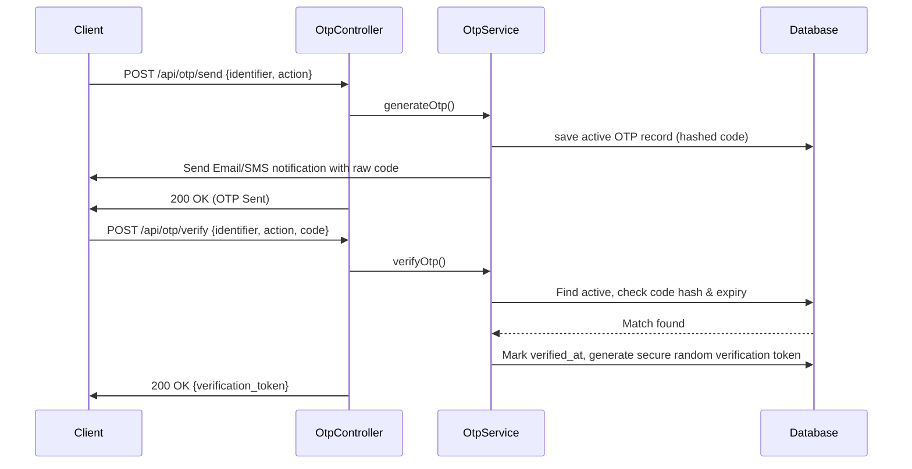

# OTP (One-Time Password) System Design Spec

Date: 2026-07-28
Plugin: `plugins/opt`

## Purpose

Cung cấp dịch vụ tạo, gửi và xác thực mã OTP (One-Time Password) qua Email hoặc SMS phục vụ cho các tính năng:
- Đăng ký tài khoản (xác thực email/số điện thoại)
- Đăng nhập không mật khẩu (OTP login)
- Khôi phục mật khẩu (Reset password)
- Xác thực giao dịch quan trọng

---

## In Scope

1. **Model `Otp`**: Lưu trữ mã, trạng thái và thời gian hết hạn.
2. **OtpService**: Logic tạo, hash, gửi qua các kênh và xác thực.
3. **Kênh phân phối (Multi-channel)**: Hỗ trợ linh hoạt qua **Email** (MailMessage), **SMS** (SmsChannel) và **Zalo ZNS** (ZnsChannel).
4. **API Endpoints**:
   - `POST /api/otp/send`: Gửi OTP.
   - `POST /api/otp/verify`: Xác thực OTP, trả về `verification_token` dùng một lần.
5. **Clean up job**: Tự động dọn dẹp các OTP hết hạn.

## Out of Scope this phase

- Tích hợp cụ thể API SDK của nhà mạng SMS và Zalo (hiện đã dựng sẵn Channels, driver mặc định ghi Log ở môi trường dev).
- Rate limit IP nâng cao (tạm thời dùng Route Throttle Middleware của Laravel).

---

## Design

### 1. Database Schema (`opts` table)

```php
Schema::create('otps', function (Blueprint $table) {
    $table->id();
    $table->string('identifier'); // email hoặc số điện thoại
    $table->string('code');       // bcrypt hoặc hashed OTP code
    $table->string('action');     // 'register', 'login', 'reset_password'
    $table->string('token');      // secure random string làm bằng chứng xác thực thành công (verify token)
    $table->timestamp('expires_at');
    $table->timestamp('verified_at')->nullable();
    $table->timestamps();

    $table->index(['identifier', 'action']);
});
```

### 2. Verification Flow



---

## API Endpoints

### 1. Send OTP
- **Route**: `POST /api/otp/send`
- **Request Body**:
  ```json
  {
    "identifier": "customer@example.com",
    "action": "register"
  }
  ```
- **Response**: `200 OK`
  ```json
  {
    "message": "OTP sent successfully"
  }
  ```

### 2. Verify OTP
- **Route**: `POST /api/otp/verify`
- **Request Body**:
  ```json
  {
    "identifier": "customer@example.com",
    "action": "register",
    "code": "123456"
  }
  ```
- **Response**: `200 OK`
  ```json
  {
    "verification_token": "secure_random_token_string_here"
  }
  ```

---

## Key Decisions

- **Mã OTP lưu dưới dạng Hash**: Không lưu trực tiếp code raw vào DB để tránh rò rỉ dữ liệu trong trường hợp DB bị compromise.
- **Verification Token**: Khi verify đúng, trả về một token ngẫu nhiên. Khi Client gọi API tạo account hoặc reset password, gửi kèm token này lên để backend verify lại mà không cần kiểm tra lại mã OTP nữa. Điều này giúp tách biệt logic OTP với logic Đăng ký/Reset Password.

---

## Testing

Feature tests trong `plugins/opt/tests/Feature/OtpTest.php` cover:
1. Gửi OTP thành công cho email hợp lệ.
2. Verify OTP đúng -> nhận về verification token.
3. Verify OTP sai/hết hạn -> trả về lỗi 422.
4. Token xác thực chỉ sử dụng được 1 lần.
